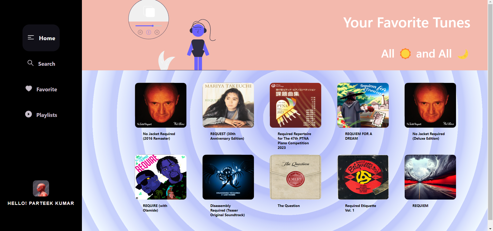
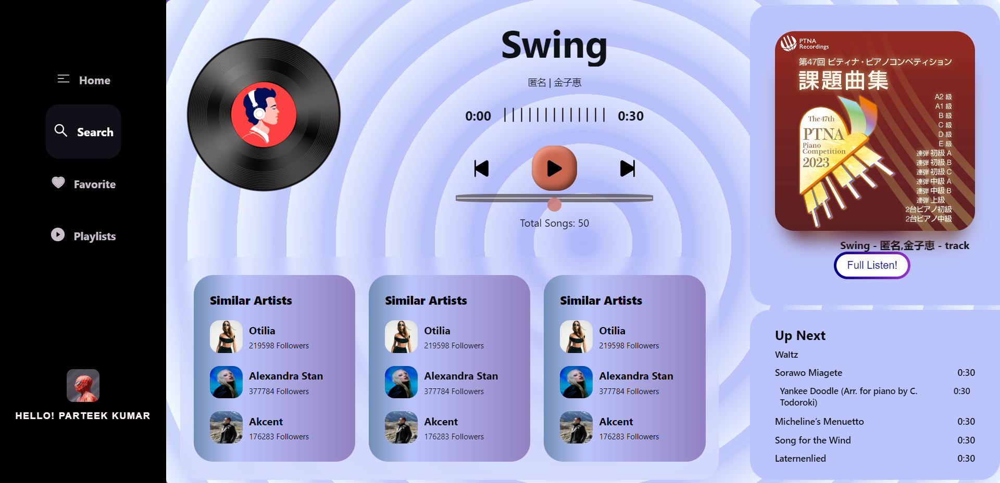
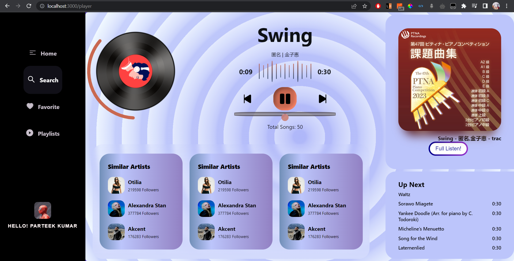
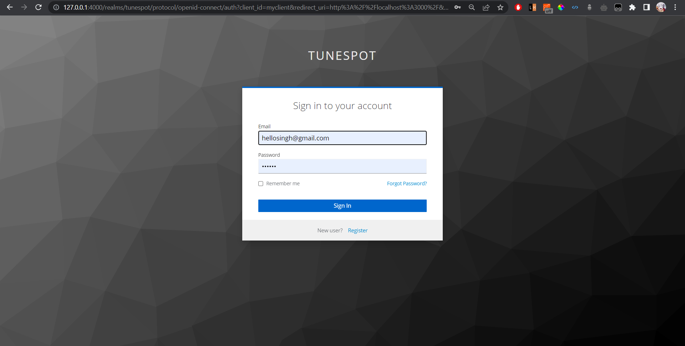
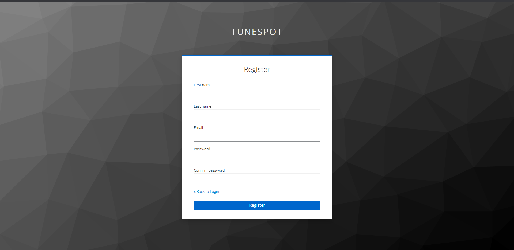
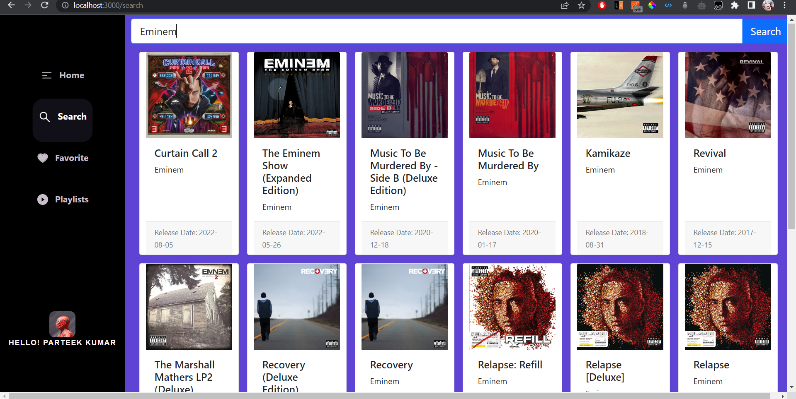
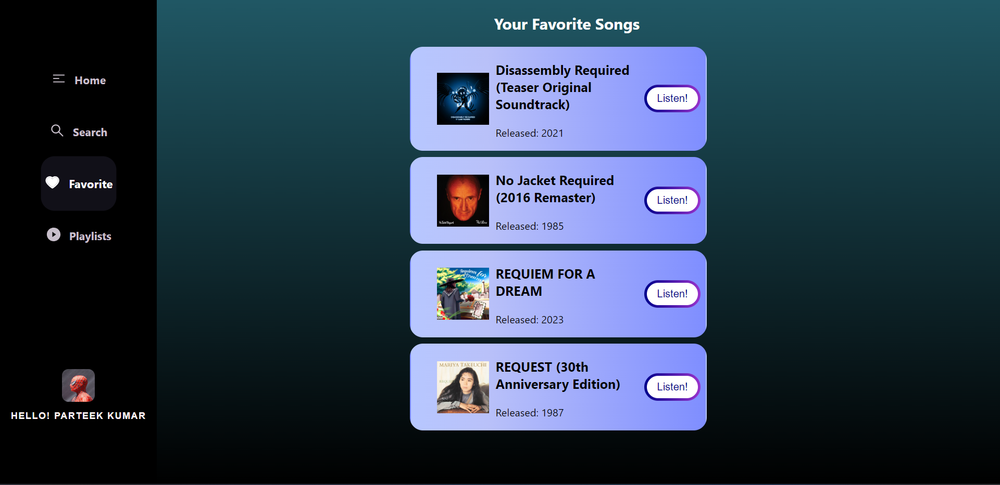

#  Tunespot, a web application built with React.js and TypeScript

Tunespot allows users to discover and listen to music from various genres and artists.

## Tech Used:
HTML, CSS , Bootstrap, ReactJs, React-Router-dom, Typescript, Keyclock.  

## Features

- Browse and search for music tracks, albums, and artists.
- Play music tracks and control playback with beautiful audioplayer screen.
- Explore recommended tracks, similar artists based on user current track playing.
- Add your most liked songs to Favorites Page
- User authentication is Done by Keycloak [User has to Login First or register if he has not signed up yet for the First time before accessing application ].
- Responsive design for seamless user experience on different devices.

## Screenshots

1) Home Screen

2) Player Screen 

##### Player Stopped:

##### Player Played:

3) Auth using Keycloack

##### Login Screen: 

##### Register Screen: 

4) Search Screen

5) Favorites Screen

## Installation

To run the Tunespot-ReactJs application locally, follow these steps:

1. Clone the repository to your local machine using the following command:

        `git clone https://github.com/parteek2813/Tunespot-ReactJs.git`

2. Navigate to the project directory:

        `cd Tunespot-ReactJs`

3. Install the dependencies using npm:

        `npm install`

4. Start the development server:

        `npm start`

Thanks!

